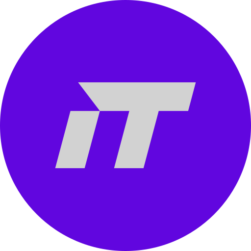

<p align="center">
  
</p>

<h1 align="center">Ashari.Tech — AI-Powered Digital Agency</h1>

<p align="center">
  Modern company profile website for <strong>Ashari.Tech</strong>, an Indonesian AI solutions company focused on helping businesses with digital transformation through custom AI, web development, SEO, and social media services.
</p>

<p align="center">
  
  
  
  
  
  
</p>

<p align="center">
  <a href="https://ashari.tech">Live Site</a> · <a href="#getting-started">Getting Started</a> · <a href="#tech-stack">Tech Stack</a> · <a href="#project-structure">Structure</a>
</p>

---


## About

Ashari.Tech is a digital agency based in Indonesia that specializes in AI-powered solutions for businesses. This repository contains the company's main website — a high-performance, visually rich marketing site built with Next.js 16, featuring advanced WebGL effects, interactive animations, and a dark-themed glassmorphism design language.

### Key Highlights

- **10 Pages** — Homepage, 4 service detail pages, pricing, portfolio, blog (with dynamic routes)
- **40+ Components** — Custom-built with advanced visual effects (WebGL shaders, canvas animations, GSAP)
- **Static Export** — Pre-rendered for maximum performance and easy deployment
- **Indonesian Market** — Full Bahasa Indonesia content with built-in i18n context
- **WhatsApp Integration** — Floating CTA button for direct client communication

---

## Features

### Visual Effects & Animations
- **FaultyTerminal** — Retro terminal/matrix shader background with mouse reactivity
- **GlassSurface** — WebGL glassmorphism with refraction distortion for badges and navbar
- **Aurora** — Perlin noise animated shader using OGL
- **Squares** — Interactive animated grid with mouse-push physics
- **BentoGrid** — Cards with global spotlight tracking, border glow, and tilt effect
- **Particles, Waves, Threads, Hyperspeed** — Procedural canvas animation backgrounds
- **Text Effects** — Rotating, scrambled, blurred, decrypted, fuzzy, and pressure-reactive text

### Pages & Content
- **Homepage** — Hero with video background, rotating text, about section, services, industries, FAQ, contact CTA
- **Service Pages** — Full-screen FaultyTerminal hero, interactive pricing tiers, feature lists, process timelines, FAQ
- **AI Solutions** — Dedicated page for AI/ML services with BentoGrid showcase
- **Pricing** — Category tabs (Website, SEO, Social Media), tier comparison with detail panels
- **Portfolio** — Project showcase with metrics and feature breakdowns
- **Blog** — Listing page with featured posts and dynamic `[slug]` routes

### Technical
- **Next.js 16 App Router** with Turbopack for fast dev builds
- **Static export** (`output: "export"`) for CDN deployment
- **Responsive design** — Mobile, tablet, and desktop breakpoints
- **SEO-ready** — Semantic HTML structure with proper heading hierarchy
- **i18n** — LanguageContext provider with 100+ translation keys

---

## Tech Stack

| Technology | Version | Purpose |
|---|---|---|
| [Next.js](https://nextjs.org/) | 16.1.4 | React framework with App Router & Turbopack |
| [React](https://react.dev/) | 19.2.3 | UI library |
| [TypeScript](https://www.typescriptlang.org/) | 5.9.3 | Type safety |
| [Tailwind CSS](https://tailwindcss.com/) | 4.1.18 | Utility-first CSS |
| [GSAP](https://greensock.com/gsap/) | 3.14.2 | Spotlight, tilt & scroll animations |
| [Motion](https://motion.dev/) | 12.29.0 | Component animations (Framer Motion) |
| [Three.js](https://threejs.org/) | 0.182.0 | 3D graphics & WebGL effects |
| [OGL](https://oframe.github.io/ogl/) | 1.0.11 | Lightweight WebGL renderer (Aurora shader) |

---

## Getting Started

### Prerequisites

- **Node.js** 18+
- **npm** or **yarn**

### Installation

```bash
# Clone the repository
git clone https://github.com/iashari/Ashari-Tech-Web-Redesign.git

# Navigate to project directory
cd Ashari-Tech-Web-Redesign

# Install dependencies
npm install

# Start development server
npm run dev
```

Open [http://localhost:3000](http://localhost:3000) in your browser.

### Build for Production

```bash
# Build static export
npm run build

# The output will be in the /out directory, ready for deployment
```

---

## Project Structure

```
src/
├── app/                              # Next.js App Router (Pages)
│   ├── layout.tsx                    # Root layout with LanguageProvider
│   ├── page.tsx                      # Homepage
│   ├── ai-solutions-indonesia/       # AI Solutions service page
│   ├── blog/                         # Blog listing
│   │   └── [slug]/                   # Dynamic blog post pages
│   ├── portfolio/                    # Portfolio showcase
│   ├── pricing/                      # Pricing comparison
│   └── layanan/                      # Service detail pages
│       ├── website-company-profile/
│       ├── seo-content-marketing/
│       └── social-media-digital-ads/
│
├── components/                       # React Components (40+)
│   │
│   │  # Layout & Navigation
│   ├── Navbar.tsx                    # Glass navbar with dropdown & mobile menu
│   ├── Footer.tsx                    # Site footer
│   ├── WhatsAppButton.tsx            # Floating WhatsApp CTA
│   │
│   │  # Page Sections
│   ├── Hero.tsx                      # Homepage hero with video background
│   ├── About.tsx                     # About section with value props
│   ├── Services.tsx                  # Services showcase
│   ├── Industries.tsx                # Industries served
│   ├── FAQ.tsx                       # Accordion FAQ
│   ├── Contact.tsx                   # Contact CTA section
│   │
│   │  # Interactive Components
│   ├── BentoGrid.tsx                 # Spotlight grid with tilt effect
│   ├── TiltCard.tsx                  # 3D tilt hover card
│   ├── TiltedCard.tsx                # Tilted card variant
│   ├── ReflectiveCard.tsx            # Card with reflection effect
│   ├── CardSwap.tsx                  # Swappable card stack
│   │
│   │  # Visual Effects & Backgrounds
│   ├── FaultyTerminal.tsx            # Matrix/terminal shader background
│   ├── GlassSurface.tsx              # WebGL glassmorphism effect
│   ├── Aurora.tsx                    # Perlin noise aurora shader
│   ├── Squares.tsx                   # Animated grid with mouse physics
│   ├── Particles.tsx                 # Particle system
│   ├── Waves.tsx                     # Wave animation
│   ├── Threads.tsx                   # Thread line animation
│   ├── Hyperspeed.tsx                # Hyperspeed tunnel effect
│   ├── GridMotion.tsx                # Motion grid effect
│   ├── GridDistortion.tsx            # Distortion grid effect
│   ├── GradientBlinds.tsx            # Gradient blinds background
│   ├── GradualBlur.tsx               # Gradual blur effect
│   │
│   │  # Text Effects
│   ├── RotatingText.tsx              # Rotating/flipping text animation
│   ├── ScrambledText.tsx             # Character scramble reveal
│   ├── BlurText.tsx                  # Blur-in text animation
│   ├── DecryptedText.tsx             # Decryption reveal effect
│   ├── FuzzyText.tsx                 # Fuzzy/glitch text
│   ├── TextType.tsx                  # Typewriter effect with GSAP cursor
│   ├── TextPressure.tsx              # Mouse-reactive variable font
│   ├── TrueFocus.tsx                 # Focus highlight text
│   │
│   │  # Utility
│   ├── ScrollReveal.tsx              # Scroll-triggered reveal animation
│   ├── AnimatedCounter.tsx           # Number counter animation
│   ├── LaserBeam.tsx                 # Laser line effect
│   └── LaserFlow.tsx                 # Flowing laser animation
│
├── context/
│   └── LanguageContext.tsx            # i18n translations (Indonesian)
│
└── globals.css                       # Tailwind 4 config & custom animations
```

---

## Pages

| Page | Route | Description |
|---|---|---|
| Homepage | `/` | Main landing page with hero, about, services, industries, FAQ, contact |
| AI Solutions | `/ai-solutions-indonesia` | AI/ML services — chatbot, computer vision, predictive analytics, NLP |
| Website Service | `/layanan/website-company-profile` | Website development packages (Rp 2.5M — 12M+) |
| SEO Service | `/layanan/seo-content-marketing` | SEO & content marketing packages (Rp 3M — 12M/month) |
| Social Media | `/layanan/social-media-digital-ads` | Social media & ads management (Rp 3M — 15M/month) |
| Pricing | `/pricing` | All service pricing comparison with interactive tier selector |
| Portfolio | `/portfolio` | Project showcase with metrics |
| Blog | `/blog` | Blog listing with featured articles |
| Blog Post | `/blog/[slug]` | Dynamic blog post pages |

---

## Brand

| Property | Value |
|---|---|
| Primary Color | `#6106DF` (Purple) |
| Background | `#000000` (Black) |
| Text Primary | `#FFFFFF` |
| Text Secondary | `rgba(255,255,255,0.7)` |
| Border | `rgba(255,255,255,0.1)` |
| Font | [Inter](https://fonts.google.com/specimen/Inter) (300–700) |
| Design Language | Dark theme, glassmorphism, WebGL effects |

---

## Responsive Breakpoints

| Breakpoint | Width | Target |
|---|---|---|
| Mobile | < 768px | Smartphones |
| Tablet | 768px — 1024px | Tablets & small laptops |
| Desktop | > 1024px | Desktop screens |

---

## Deployment

This project is configured for **static export**. After running `npm run build`, the `/out` directory contains the full static site ready for deployment to any CDN or static hosting:

- **Vercel** (recommended)
- **Netlify**
- **GitHub Pages**
- **Cloudflare Pages**
- **Any static file server**

---

## Author

**Ashari.Tech**
- Website: [ashari.tech](https://ashari.tech)
- Email: contact@ashari.tech
- WhatsApp: [+62 852-8045-2688](https://wa.me/6285280452688)
- GitHub: [@iashari](https://github.com/iashari)

---

<p align="center">Built with passion in Indonesia</p>
